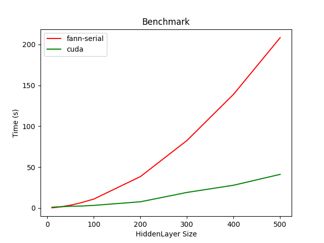

# Cuda implementation of NN

The folder `cuda-nn` contains a from-scratch `CUDA` based implementation of a **Fully Connected Neural Networks** library that supports using any number of hidden layers where each layer can have any size. Each layer can either have `No activation`, `Sigmoid Activation` or `ReLU activation`.   

The implementation supports batch gradient descent algorithm with a fixed learning rete. In each epoch the whole data is divided into batches of size `BATCH_SIZE`. On each batch forward & back propagation is run and then the weights are updated.  

## Setup

The `cuda-nn` implementation is compared with the serial `fann` implementation on the `abelone.train` dataset. The Neural network contains 5 layers: 1 input, 1 input and 3 hidden layers. The sizes of the hidden layers are varied and the training time is compared for the two implementations. The `fann` is set up to use `FANN_TRAIN_BATCH` mode.  Both the implementations are run for 100 epochs.  

## Optimizations
Note: The benchmarks for optimizations are run on the above setup only with 3 hidden layers of size 500.
However the optimizations are coded for any general NN. They are not hardcoded to work only for the above setup.  

Using `nvprof` it was found that `weightUpdate` and `backPropagation` kernels are the bottlenecks. 

**optimization 1**: Pipelining `weightUpdate` and `backPropagation`.
instead of first serially performing back-propagation on the complete network and then serially performing weight updates,

we can pipeline these two by noting that weights for layer(i) can be updated when the back-propagation is done on layer(i+1).

this reduces the time for 500 size layer in the above setup to **~31 seconds from ~41 seconds**.  

**optimization 2**: using matrix transpose to coalesce memory accesses.  
the weightUpdate and `backPropagation` kernels are the bottle-neck because they need to multiply with a transposed matrix. 
In the initial implementation this is done just by transposing the indexes(and not the actual matrix) to read from the matrix.   
This leads to non-coalesced, scatted reads which causes the bottleneck.   

For this, an efficient matrix transpose implementation is used and then the transposed matrix is used in the multiplication. Each thread block first issues coalesced reads in the global memory and stores the transpose in shared memory. In then issues coalesced writes to the global memory by using the transpose stored in shared mem.   
The runtime is reduced to **~15s from ~31s**. 

**optimization 3**: matrix multiplication. optimization using shared mem.  
We can notice that in matrix multiplication each element is read O(n) times. Thus it will be better to first move the elements to the shared memory and then perform multiplication.  
The way to do this is to use a technique called tiling [4], where the matrixes are divided into tiles which are stored in shared mem and then computed upon.   
[see 'cuda-nn/src/layer.cu:forwardProp' for the code with comments].   
The matrix mult. optimization is applied to all the 3 kernels:(forwardProp, backwardProp, updateWeights) and the running time is further reduced to **~5.3s from ~15s**.   

## References
[1](https://www.csd.uwo.ca/~mmorenom/HPC-Slides/Optimizing_CUDA_Code-2x2.pdf)
[2](https://on-demand.gputechconf.com/gtc/2014/presentations/S4158-cuda-streams-best-practices-common-pitfalls.pdf)
[3](https://github.com/stanford-cs149/asst3)
[4](https://www.youtube.com/watch?v=o7h_sYMk_oc)
[5](https://docs.nvidia.com/cuda/archive/11.6.1/cuda-c-best-practices-guide/index.html)